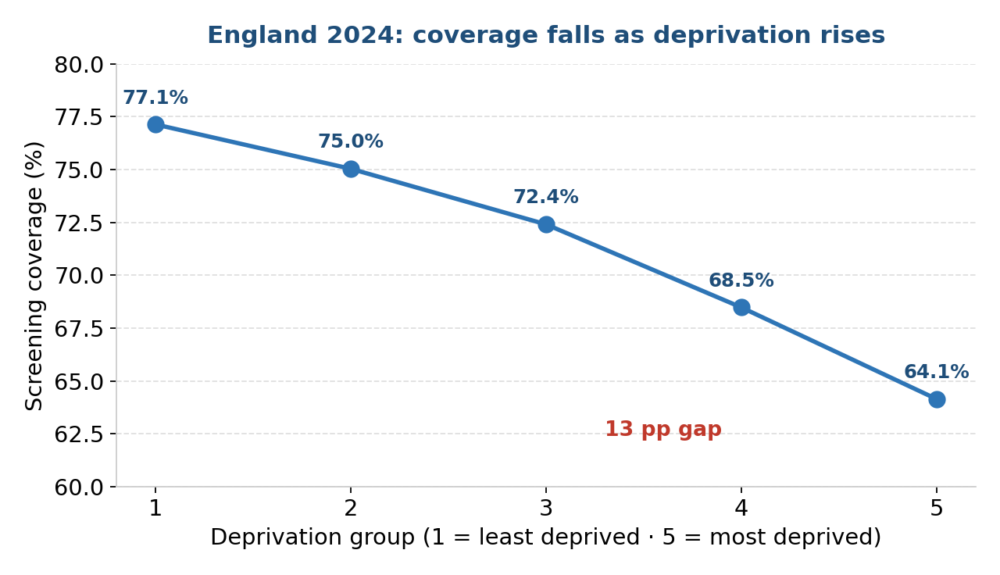
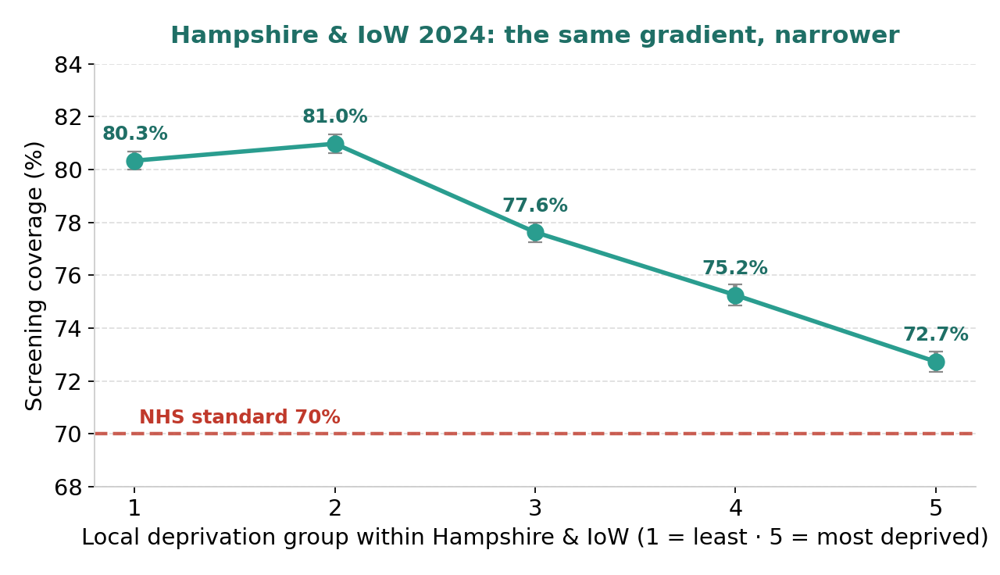
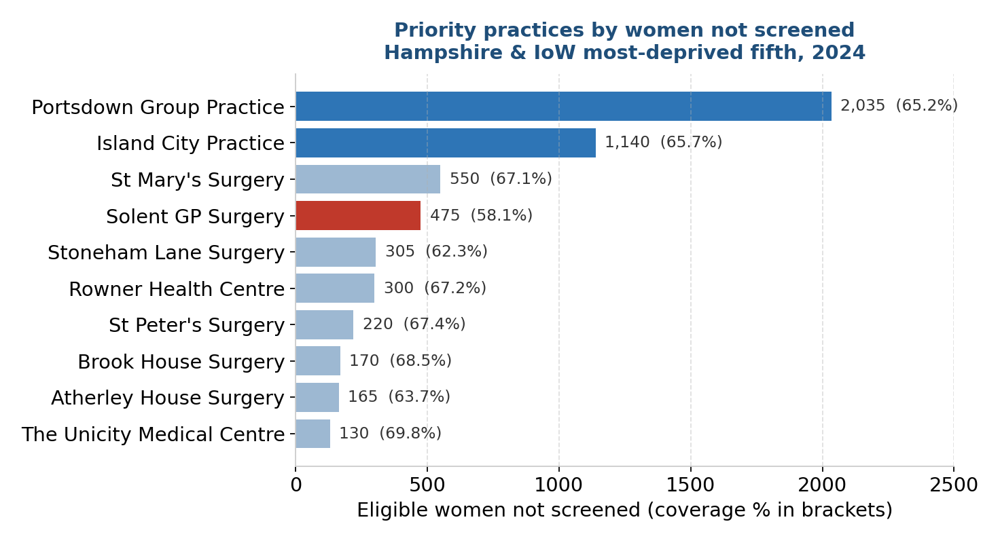

# Breast Cancer Screening Inequalities in England

A health-equity analysis of NHS breast screening coverage, with a local focus on Hampshire & Isle of Wight. Built as a self-directed portfolio project to move into public health data analysis.

**Author:** Marina Volkaert
**Tools:** Python (pandas, NumPy, matplotlib), Google Colab

> *Coded in Python with AI support as a learning aid, while actively building my own coding fluency.*

---

## The question

Breast screening saves lives by catching cancer early, but does it reach everyone equally? This project uses open national data to ask:

1. Does screening coverage fall as deprivation rises, and is any gap real rather than chance?
2. Does the same pattern hold locally, within Hampshire & Isle of Wight?
3. Which specific practices should a local public health team target first?

It matters to me because I lost someone very close to an aggressive breast cancer, and I want to use data to help improve community wellbeing and reduce health inequalities.

---

## Data sources

| Source | What it provided |
|---|---|
| OHID Fingertips, indicator **94063** | Breast screening coverage, women 53–70, GP-practice level, 2024 |
| Health Equity Evidence Centre | Practice-level Index of Multiple Deprivation (IMD), modelled to 2024 |
| NHS Organisation Data Service (ODS) | List of active Hampshire & IoW GP practices |
| NHS Breast Screening Programme standard **BSP-S02** | The 70% acceptable coverage standard |

All data is open and aggregated. No patient-level or personal data was used.

---

## Method

1. **Source & clean**: loaded the screening data, filtered to ~6,170 GP practices and to a single year (2024).
2. **Join deprivation**: joined each practice to its IMD score on the NHS practice code (inner join, keeping fully-matched practices).
3. **Group & measure**: ranked practices into five deprivation groups; coverage was pooled by number of women (population-weighted), not averaged across practices.
4. **Test**: calculated 95% confidence intervals to confirm the gradient is statistically real.
5. **Localise & prioritise**:  restricted to Hampshire & IoW via the ODS list, re-ranked deprivation locally, and identified priority practices by number of women not screened.

---

## Findings

### 1. A clear national gradient

Coverage falls at every step, from **77.1%** in the least deprived fifth to **64.1%** in the most deprived — a **13 percentage-point gap**. The 95% confidence intervals are about 0.1% wide and never overlap, so the gradient is real, not chance.



### 2. The same pattern holds locally

Within Hampshire & IoW the gradient is narrower (~8 points), as expected in a more affluent area, but the fall through the mid and most-deprived groups is statistically significant. Every group *average* sits above the 70% standard - yet that average hides **10 individual practices below it**.



### 3. Where to act first

Ranked by the number of eligible women not screened, the priority practices are led by Portsdown Group Practice (~2,035 women) and Island City Practice (~1,140). Solent GP Surgery has the most acute rate at 58.1%. Lifting just the top four practices to the 70% standard would mean screening roughly **600 more women**.



---

## Recommendation

Target the priority practices, matching each action to a likely barrier:

- **Mobile screening units** sited at the largest priority practices, in familiar community locations, to remove travel and time barriers.
- **Extended-hours and weekend appointments** for women who lose pay attending in the working day.
- **Community outreach and reminders** through these practices, in relevant languages, to build awareness and trust.
- **Address-data cleaning** at high-churn practices, so invitations actually arrive.

Possible barriers are drawn from published evidence (e.g. Cancer Research UK), not inferred from this dataset.

---

## Limitations & data ethics

- Coverage is a three-year measure, so it lags recent change.
- Deprivation is modelled at practice level and describes *areas, not individuals* (ecological fallacy) — findings are not claims about any single woman.
- 16 practices (0.3%) were excluded for missing deprivation or screening data; some small-number figures are suppressed at source.

---

## Repository contents

```
├── README.md
├── notebook/
│   └── Breast_Cancer_Screening_Inequalities.ipynb   # full analysis
├── charts/
│   ├── national.png
│   ├── local.png
│   └── priority.png
├── presentation/
│   └── Breast-Screening-Inequalities-Presentation.pptx
└── brief/
    └── Project-Brief.docx
```

## Sources

- NHS Breast Screening Programme screening standards (BSP-S02 Coverage), GOV.UK
- OHID Fingertips, Cancer Services profile, indicator 94063
- Health Equity Evidence Centre, practice-level IMD dataset
- Cancer Research UK, supporting access to breast screening
